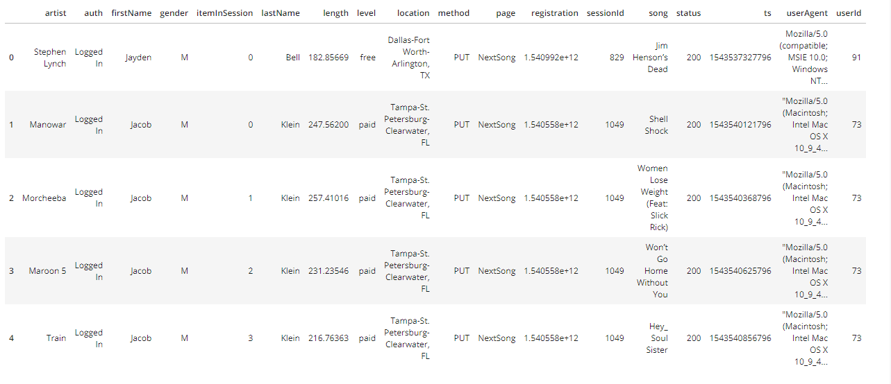

# AWS Data Lake

## Introduction
A music streaming startup, Sparkify, has grown their user base and song database even more and want to move their data warehouse to a data lake. Their data resides in S3, in a directory of JSON logs on user activity on the app, as well as a directory with JSON metadata on the songs in their app.

As their data engineer, you are tasked with building an ETL pipeline that extracts their data from S3, processes them using Spark, and loads the data back into S3 as a set of dimensional tables. This will allow their analytics team to continue finding insights in what songs their users are listening to.

You'll be able to test your database and ETL pipeline by running queries given to you by the analytics team from Sparkify and compare your results with their expected results.

## Database schema design
Using the song and log datasets, you'll need to create a star schema optimized for queries on song play analysis. This includes the following tables.

- Fact Table:
  **songplays**: a table stores all song play when user using app, records in log data associated with song plays i.e. records with page NextSong
  fields of songplays table: songplay_id, start_time, user_id, level, song_id, artist_id,   session_id, location, user_agent
- Dimension Tables:
 1. **users**: a table stores all user that using app.
    fields of users table: user_id, first_name, last_name, gender, level
 2. **songs**: a table stores all songs in music database.
    fields of songs table: song_id, title, artist_id, year, duration
 3. **artists**: a table stores all artists data in music database.
    fields of artists table: artist_id, name, location, latitude, longitude
 4. **time**: a timestamps of records when user using app and broken down into pecific units like hour, day, week, month, year, weekday they using app.
    fields of time table: start_time, hour, day, week, month, year, weekday

## ETL Process
1. First part, perform ETL on the first dataset song_data, to create the songs and artists dimensional tables. 
   song_data look like:
   
   
   Then store data into songs table, just select columns for artist ID, name, location, latitude, and longitude from dataset song_data to store into songs table. Same as songs table, select columns for artist ID, name, location, latitude, and longitude from dataset song_data to store into artist table. 
2. Second part, perform ETL on the second dataset log_data, to create the time and users dimensional tables, as well as the songplays fact table.
   log_data look like:
   
   
   Filter records by 'NextSong' value in page column, then convert the ts timestamp column to datetime, extract the timestamp, hour, day, week of year, month, year, and weekday from the ts column and set time_data to a list containing these values in order then store into song Select columns for time table like start_time (ts column formerly), hour, day, week, month, year, weekday from dataset song_data to store into time table. Same as time table, select columns for user ID, first name, last name, gender and level and store to user table.
   
3. Last, perform ETL on log_data dataset, songs and artist tables to store to fact table songplay table.
   Get songid and artistid from song and artist tables using song_select query in sql_queries.py file. Then select songplay_id, start_time, user_id, level, song_id, artist_id, session_id, location, user_agent to store to songplays table.

### Description of files
1. **etl.py** reads and processes files from song_data and log_data and loads them into tables. Load data from s3 and using spark to load them back into s3 datalake.
2. **README.md** provides discussion on project.
3. **df.cfg** provides all configs from for project.

### How to run project.
Please run file etl.py in command line by *run etl.py*