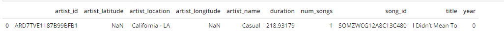

# README.MD
## Summary Project: Data Modeling with Postgres
### Introduction
A startup called Sparkify wants to analyze the data they've been collecting on songs and user activity on their new music streaming app. The analytics team is particularly interested in understanding what songs users are listening to. Currently, they don't have an easy way to query their data, which resides in a directory of JSON logs on user activity on the app, as well as a directory with JSON metadata on the songs in their app.

They'd like a data engineer to create a Postgres database with tables designed to optimize queries on song play analysis, and bring you on the project. Your role is to create a database schema and ETL pipeline for this analysis. You'll be able to test your database and ETL pipeline by running queries given to you by the analytics team from Sparkify and compare your results with their expected results.

### Project Description
In this project, you'll apply what you've learned on data modeling with Postgres and build an ETL pipeline using Python. To complete the project, you will need to define fact and dimension tables for a star schema for a particular analytic focus, and write an ETL pipeline that transfers data from files in two local directories into these tables in Postgres using Python and SQL.

### Database design the fact and dimension tables
Using the song and log datasets, you'll need to create a star schema optimized for queries on song play analysis. This includes the following tables.

- Fact Table:
  **songplays**: a table stores all song play when user using app, records in log data associated with song plays i.e. records with page NextSong
  fields of songplays table: songplay_id, start_time, user_id, level, song_id, artist_id,   session_id, location, user_agent
- Dimension Tables:
 1. **users**: a table stores all user that using app.
    fields of users table: user_id, first_name, last_name, gender, level
 2. **songs**: a table stores all songs in music database.
    fields of songs table: song_id, title, artist_id, year, duration
 3. **artists**: a table stores all artists data in music database.
    fields of artists table: artist_id, name, location, latitude, longitude
 4. **time**: a timestamps of records when user using app and broken down into pecific units like hour, day, week, month, year, weekday they using app.
    fields of time table: start_time, hour, day, week, month, year, weekday
    
    
    
### How to run project
1. Firstly, to run project, please open runner.ipynb file and run the **first cell code**: **%run create_tables.py**. This cell code will run file **create_tables.py**. Or if you can run file **create_tables.py** in terminal.
2. You can check if you connected to **sparkifydb** db by run the file jupyter test.ipynb. Check each line cell code in turn and see if no error founds that my code run correctly.
3. Please open runner.ipynb file and run the **second cell code**: **%run etl.py**. This cell code will run file **etl.py**. Or if you can run file **etl.py** in terminal. Follow step by step by see file **etl.ipynb** to understand step by step of how to implement **etl.py**.

### Description of files
1. **test.ipynb** displays the first few rows of each table to check database, then Sanity Tests below of file to help developer check SQL, data and tables quality.
2. **create_tables.py** drops and creates tables like fact table and dimension table. Run this file to reset tables before each time run ETL scripts.
3. **etl.ipynb** reads and processes a single file from song_data and log_data and loads the data into tables. This notebook contains detailed instructions on the ETL process for each of the tables.
4. **etl.py** reads and processes files from song_data and log_data and loads them into tables. Fill this out based on work in the ETL notebook.
5. **sql_queries.py** contains all sql queries, and is imported into files etl.py, etl.ipynb, create_tables.py.
6. **README.md** provides discussion on project.
8. **runner.py** provides running of **create_tables.py**, **etl.py** files in project. The first file must run in project, It will run **create_tables.py** first to generate fact table and dimension tables, then run **etl.py** to process handle preprocess data from directory and stores data to tables.

### ETL Process
1. First part, perform ETL on the first dataset song_data, to create the songs and artists dimensional tables. 
   song_data look like:
   
   
   Then store data into songs table, just select columns for artist ID, name, location, latitude, and longitude from dataset song_data to store into songs table. Same as songs table, select columns for artist ID, name, location, latitude, and longitude from dataset song_data to store into artist table. 
2. Second part, perform ETL on the second dataset log_data, to create the time and users dimensional tables, as well as the songplays fact table.
   log_data look like:
   
   
   Filter records by 'NextSong' value in page column, then convert the ts timestamp column to datetime, extract the timestamp, hour, day, week of year, month, year, and weekday from the ts column and set time_data to a list containing these values in order then store into song Select columns for time table like start_time (ts column formerly), hour, day, week, month, year, weekday from dataset song_data to store into time table. Same as time table, select columns for user ID, first name, last name, gender and level and store to user table.
   
3. Last, perform ETL on log_data dataset, songs and artist tables to store to fact table songplay table.
   Get songid and artistid from song and artist tables using song_select query in sql_queries.py file. Then select songplay_id, start_time, user_id, level, song_id, artist_id, session_id, location, user_agent to store to songplays table.
   
